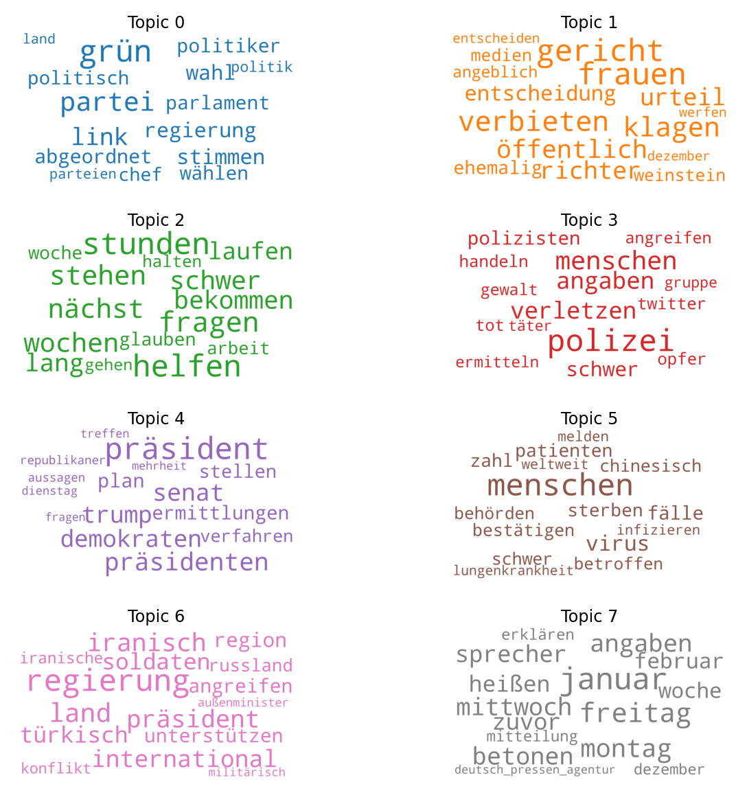
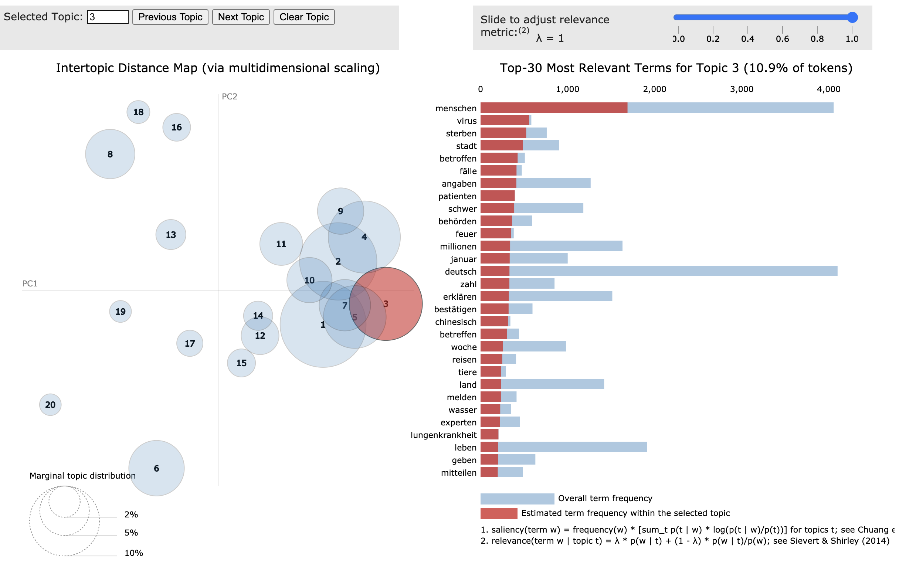

# Topic Modeling using Latent Dirichlet Allocation

## What is Latent Dirichlet Allocation?

A common topic modeling method is *Latent Dirichlet Allocation* first proposed by [David Blei, Andrew Ng und Michael I. Jordan](https://www.jmlr.org/papers/volume3/blei03a/blei03a.pdf) in 2003. It is a general statistical model that allows to find and identify topics within documents. It posits that each document consists of a mixture of topics, and each word in a document is attributed to a specific topic. The sets of words that make up the topics are then in an iterative training process identified. The only variable that has to be specified beforehand is the number of topics.

## Building a corpus from newspaper articles

To test this method I am going to build a textcorpus consisting of newspaper articles. This is a somewhat straightforward example since we can assume the existence of distinct topics. I chose *zeit.de* since it was easy to scrape and the information on each page could be easily parsed. Further, they also provide some topic tags for each article which could be later used as a reference to evaluate the model's performance. 

The scraping is done using Python's asynchronous framework *asyncio*, which greatly improves speed since many articles can be downloaded and processed at once. For reference, I was able to download one year of articles (around 70 thousand) within an hour. The text of each article and some extra information, such as title, authors, tags, etc. is saved in a sqlite database.

## Preprocessing

In order to achieve good results we need to preprocess the text of each article. Ideally, we want to end up with words that are decisive for a topic (e.g. `president`) and also with as few words as necessary. In a first step we will remove all numbers, any type of punctuation, quotation marks, etc. Then we will filter out all words that are not nouns, adjectives, adverbs or verbs. It is also a good practice to identify bigrams and trigrams, as for example the bigram `white_house` carries different semantic information as the separate unigrams `house` and `white`. Further, we will lemmatize the remaining words, a process by which inflected words are transformed into their base form. These steps greatly decrease the size of unique words. Additionally, we will remove words that appear in almost all documents, and are probably not distinctive enough. 

Note: Stemming is generally also a good idea, however, I could not find a good library that supports German. 

In a final preprocessing step we will calculate bag-of-words representations for each document, which could be understood as a vector pointing into a specific direction depending on which words and how often they were used in a document. 

# Results

## Model:

To evaluate the model, we can look at the most common keywords for each identified topic. For example these are the 30 most common words of two topics:

Topic 1:

> 0.054*"menschen" + 0.022*"virus" + 0.017*"fälle" + 0.015*"patienten" + 
  0.015*"sterben" + 0.015*"zahl" + 0.014*"schwer" + 0.013*"chinesisch" + 
  0.013*"bestätigen" + 0.013*"behörden" + 0.013*"betroffen" + 0.009*"melden" +
  0.009*"weltweit" + 0.009*"infizieren" + 0.008*"lungenkrankheit" +
  0.008*"auslösen" + 0.007*"übertragen" + 0.007*"ärzte" + 0.007*"krankheit" +
  0.007*"provinz" + 0.007*"januar" + 0.007*"chinesische" +
  0.007*"infektionen" + 0.007*"angaben" + 0.006*"behandeln" +
  0.006*"ausbruch" + 0.006*"erkranken" + 0.005*"anstecken" +
  0.005*"millionen" + 0.005*"stadt"
 

Topic 2:

> 0.035*"präsident" + 0.022*"präsidenten" + 0.020*"senat" + 0.020*"trump" +
  0.020*"demokraten" + 0.013*"plan" + 0.012*"ermittlungen" + 0.012*"stellen" +
  0.010*"verfahren" + 0.010*"republikaner" + 0.009*"aussagen" +
  0.009*"treffen" + 0.009*"dienstag" + 0.009*"mehrheit" + 0.009*"fragen" +
  0.008*"stimmen" + 0.008*"früh" + 0.008*"zeugen" + 0.007*"mittwoch" +
  0.007*"senatoren" + 0.006*"woche" + 0.006*"sprechen" + 0.006*"politisch" +
  0.006*"entscheiden" + 0.006*"affäre" + 0.006*"palästinenser" +
  0.006*"national" + 0.006*"donnerstag" + 0.006*"informationen" +
  0.006*"schiff"

Further, we can calculate the coherence score, which tells us how often or how strong the keywords of a topic co-occur in the text corpus. The higher score the better the model. This could also be evaluated on a text corpus that the model has not seen during training.

## Word Clouds

Plotting word clouds can also give us a good idea about which topics have been recognized. For example here we can also see that words for weekdays and months should probably be removed to allow for more meaningful topics (see topic 7):

## pyLDAvis

Another popular visualization method is pyLDAvis:

You can test this representation for a small model trained with [Gensim's LDA implementation](https://htmlpreview.github.io/?https://github.com/jonasengelmann/topic_modeling_example/blob/master/pyLDAvis_lda.html) and one with [Mallet's](https://htmlpreview.github.io/?https://github.com/jonasengelmann/topic_modeling_example/blob/master/pyLDAvis_lda_mallet.html)